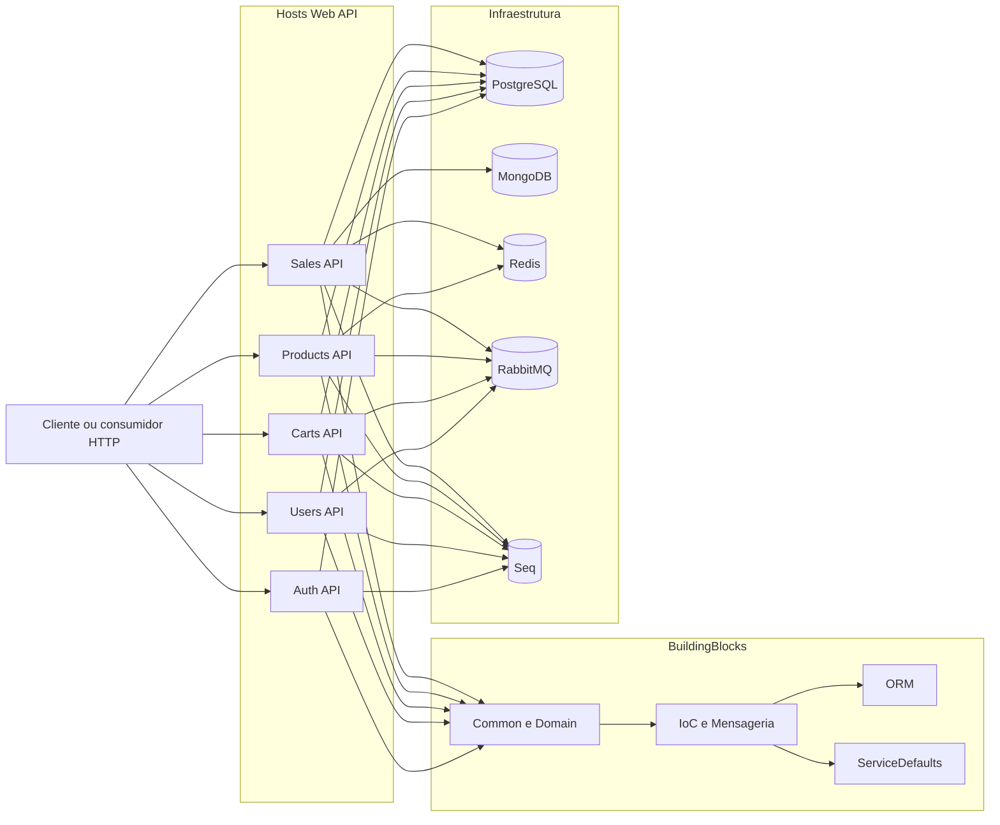
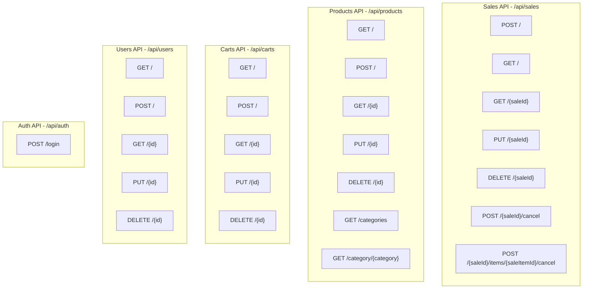
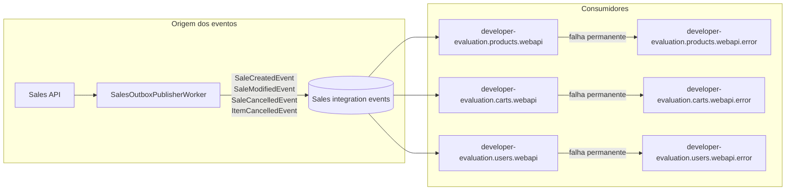

# Arquitetura

## Visão geral

O projeto está organizado como um backend em .NET 8 com separação física por contexto de negócio dentro de um único repositório. Cada contexto possui suas próprias camadas `Application`, `Domain`, `Infrastructure` e `WebApi`, enquanto os elementos compartilhados ficam em `src/BuildingBlocks`.

Os cinco hosts HTTP são:

- `Sales`
- `Products`
- `Carts`
- `Users`
- `Auth`

Os principais componentes de infraestrutura são:

- PostgreSQL para persistência transacional.
- MongoDB para armazenamento complementar de auditoria e event log no fluxo de vendas.
- Redis para cache-aside do catálogo de produtos.
- RabbitMQ para integração assíncrona entre `Sales` e os consumidores `Products`, `Carts` e `Users`.
- Seq para consulta de logs estruturados.

## Diagrama de componentes

## Organização em camadas

- `WebApi`: controllers, composição HTTP, rate limiting, timeout, health checks e mapeamento de `Result<T>` para respostas HTTP.
- `Application`: casos de uso, contratos, orquestração e regras de aplicação.
- `Domain`: entidades, regras centrais, eventos de domínio e invariantes.
- `Infrastructure`: integração externa por contexto, persistência e implementações concretas.
- `BuildingBlocks`: componentes compartilhados de mensageria, resiliência, persistência, middlewares e hosting.

## Superfície de API

As rotas estão separadas por contexto e seguem convenção REST, com exceções explícitas para autenticação e comandos de cancelamento em `Sales`.

## RabbitMQ e integração assíncrona

O fluxo assíncrono atual é centrado em `Sales`:

- `Sales` persiste eventos na outbox.
- `SalesOutboxPublisherWorker` publica os eventos pendentes no RabbitMQ.
- `Products`, `Carts` e `Users` se inscrevem nos eventos de vendas.
- Os consumidores usam deduplicação persistida por `messageId`.
- Cada fila possui DLQ explícita com sufixo `.error`.

Eventos publicados hoje:

- `SaleCreatedEvent`
- `SaleModifiedEvent`
- `SaleCancelledEvent`
- `ItemCancelledEvent`

## Decisões arquiteturais relevantes

- O repositório está pronto para evolução incremental por contexto, mas ainda opera como uma solução única para desenvolvimento local.
- `Sales` concentra as regras mais ricas do domínio e também a publicação dos eventos de integração.
- Os consumidores de RabbitMQ em `Products`, `Carts` e `Users` tratam eventos de vendas de forma idempotente.
- `Products` usa cache-aside com Redis para consultas frequentes de catálogo, categorias e detalhes.
- A observabilidade combina logs estruturados, métricas de resiliência e métricas de desvio para DLQ.
- O ambiente de execução local é baseado em Docker Compose.